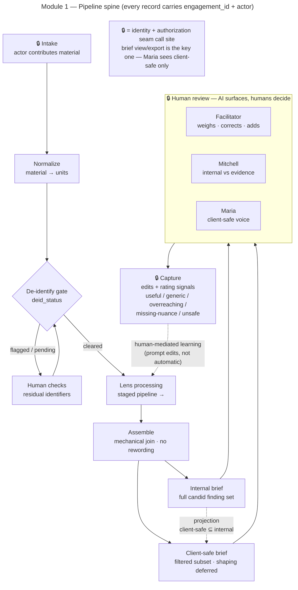
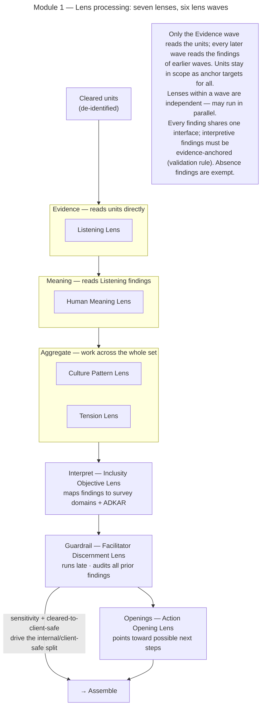
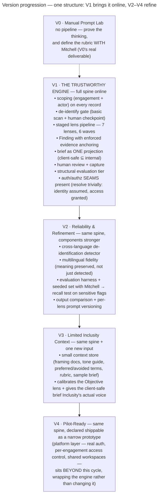

> Edited only in the chat where this file is the working copy. All other chats: read-only reference.

# Build Approach (SMI Internal)

*The following sections describe how SMI will build Human Lens — the development sequence, prompt design, and technical roadmap. They are oriented to the SMI team rather than to the client.*

---

## How to Read This Document

This document uses a handful of terms precisely and repeatedly. They are easy to
conflate, so they are defined here once, up front.

**Client** — the organization Inclusity is serving in an engagement. A client is
never a user of the system.

**Lens** — *an analytical pass where the AI is used.* A lens is a distinct prompt
and response section in one AI pass.

**Module** — *a self-contained analysis, structured as a pipeline of functional
stages — one of which runs its lenses.* Human Lens is a suite of eight modules
(the full set appears in Part 1); the Listening Brief is **Module 1**, the only
module built in this document — the other seven appear only as the suite they
belong to, in Part 1. Module 1 has seven lenses, the Listening Lens through the
Action Opening Lens; the **pipeline** that runs them is defined below.

**Pipeline** — *how a module runs.* A module is a pipeline: material enters, passes
through a fixed sequence of **stages** comprising the spine of the pipeline, and
leaves as a reviewed **brief** (defined below) plus captured learning. A **stage** is one step
in that sequence — a single operation performed as the material passes through. The
ordered run of stages comprises the pipeline's **spine**: intake → normalize →
de-identify gate → lens processing → assemble → human review → capture. The lenses do
their work in the lens-processing stage, organized into **lens waves** (below). (Part 2 details the spine.)

**Lens wave** — the lens-processing stage runs the module's lenses grouped into an
ordered sequence of six waves: Evidence → Meaning → Aggregate → Interpret →
Guardrail → Openings. Each wave is comprised of a set of lenses sharing a particular role
(suggested by the name of the wave). Lenses in a wave are independent of one
another, run in parallel, and read the findings of earlier waves' lenses (all
findings accumulate in one shared pool, tagged by the lens that produced them).
Waves comprise the internal structure of the lens-processing stage. They are not
themselves stages.

**Gate** — a stage that material must clear before it may continue. Module 1 has
one: the **de-identification gate**. De-identification proper is done by a person at
Inclusity *before* material is brought in, so what the engine receives is already
de-identified; the gate is a verifying backstop — it scans for any identifying
language a human missed and holds it for review, and nothing reaches the lenses
until it is cleared.

**Brief** — a module's deliverable to Inclusity, produced from one set of findings
in two **types**:

- **internal brief** — the module's complete set of candid findings. For the
  Inclusity people who can hold that candor — the facilitator and Dr. Campbell.
- **client-safe brief** — the subset of the module's findings that may be shown to
  the client. A finding reaches it only by being affirmatively cleared and not held
  back by sensitivity; it is a pure **projection** of the internal (**client-safe ⊆
  internal**), never a rewrite. It is the exported deliverable the client receives.

**Promotion** — the act of clearing a finding into the client-safe brief. Every
finding is **held** — internal-only — by default; a finding reaches the client-safe
brief only by being affirmatively *promoted* (`cleared_to_client_safe` set true) and
not held back by its `sensitivity` flag. Because held is the default, the safe
failure mode is silence: anything un-promoted or uncertain stays internal-only,
never exposed to the client.

**Seam** — an interface boundary where the concrete implementation is injected and
can be replaced without touching the call sites: callers depend only on the
abstraction, while the real policy or implementation sits behind it — and may
resolve trivially at first, with a faithful implementation swapped in later. Seams
in this architecture include identity, authorization, the repository (persistence),
the LLM provider, the de-identification detector, and export; each exists so the
engine can depend on an abstraction now and acquire its real implementation later
without rework.

**Engine** — the software that runs a module's pipeline end to end (intake through
capture): its stages, the lenses it invokes, the findings they produce, and the
brief it assembles. It is what Versions 1–4 build, engagement- and actor-aware
throughout. The engine needs no platform to run; the **platform** (defined below)
wraps it without changing it.

**Platform** — the wrapper around the engine, supplying what the engine
deliberately defers: real **authentication** and **authorization** (login,
roles, per-engagement grant and revoke) and **shared workspaces** — the
per-engagement collaborative model in which everyone authorized on an engagement
works on its one brief, each action attributed. The engine enforces that sharing at
the data level from Version 1; the platform later adds the real accounts and
workspace around it. It is deferred
beyond Version 4; until then those access checks live in the engine as **seams**
that resolve trivially (identity assumed, access granted), so the platform can later
slot in behind them without touching the engine.

**Authentication / Authorization** — the two access checks the platform implements,
present in the engine as **seams** from Version 1. *Authentication* is "who is
this" — identity, resolved at the request boundary and threaded inward (the engine
never parses sessions). *Authorization* is "may this actor do this" — enforced by
the engine at each operation, so the decision holds whatever calls it. Both resolve
trivially until the platform supplies real login, roles, and per-engagement grants.

**Version** — *how mature the build is.* The build proceeds through five versions,
**V0 (Manual Prompt Lab) through V4 (Pilot-Ready)**. Version is not a finer
division of Module or Lens; it is a separate axis that crosses them. Every version
in this document lives inside Module 1 — V0–V4 mature that one module — so Version
and Module are orthogonal, not nested.

In short: **a Module contains Lenses; Version is an independent maturity axis; and
every Version here sits inside Module 1.**

**Parts** — the document has three parts, each written in its own **register** —
the mode and purpose a stretch of writing takes on (here: the persuasive case, the
engineering spec, the build plan):

- **Part 1 · The Case** — why this plan and this first module fit SMI, the
  eight-module suite and its build order, the lens method in general, and the
  Inclusity stakeholders. The suite-level view, where Module means *1 of 8*.
- **Part 2 · The Build — Module 1** — Module 1's seven lenses and the system
  architecture that runs them. Everything here is Module 1; the scope is stated
  once and inherited.
- **Part 3 · The Roadmap — Module 1** — the V0–V4 maturity sequence, also entirely
  Module 1. Each version says what changes, never which module.

---

## Part 1 · The Case

### Why This Plan Fits SMI

*(Internal SMI rationale — why this plan, and this first module, fit SMI and the partnership.)*

#### Strategic fit for SMI and the partnership

For **SMI**, it becomes the first artifact of the business under consideration: human-centered AI systems for organizations doing transformational work.

For **Sasha**, it uses her strengths: emotional intelligence, voice, facilitation, story, meaning, integration.

For **Doug**, it uses his: systems, software, AI implementation, workflow architecture, and operational grounding.

That is exactly the "vision + systems" partnership pattern this collaboration is built on.

#### Why Listening Brief is the right first build for SMI

**1. It is technically learnable from "near zero"**

You do not need advanced machine learning to start.

Version 0 can be done with:
- carefully designed prompts
- sample/de-identified text
- output templates
- human evaluation
- iteration

Then later you add:
- structured outputs
- document upload
- quote extraction
- anonymization checks
- evaluation rubrics
- saved results
- limited retrieval/context

So it is a perfect learning ramp. It begins simple, but it can grow into serious AI development.

**2. It produces impressive demos quickly**

A good demo could be very concrete:

*Input: 60 anonymous employee comments.*

*Output:*
- 7 recurring themes
- 3 hidden tensions
- 5 representative quotes
- areas of disagreement
- facilitator questions
- leadership implications
- client-safe summary
- internal-only notes
- sensitive items requiring human review

That is the kind of output people can immediately understand. It is much easier to communicate than saying, "We build human-centered AI systems."

**3. It fits SMI's future positioning**

SMI is not trying to become a generic AI shop. The opportunity is more like: human-centered AI systems for organizations doing transformation, culture, brand, retreats, facilitation, and meaning-making work.

Qualitative synthesis is central to that entire category. It applies beyond Inclusity too:
- retreat feedback analysis
- participant applications
- client discovery
- testimonials
- brand interviews
- workshop notes
- founder voice extraction
- organizational listening

So the skill transfers directly back into Sasha's business.

**4. The human sensibility is essential, not decorative**

The technical side can make the AI produce structured output. But human judgment is what determines whether the output is emotionally accurate, too generic, too corporate, too confident, missing nuance, ethically awkward, useful to a facilitator, or respectful of human complexity.

That makes this a genuine partnership task — the human/facilitation intelligence becomes part of the system design, not something added at the end.

**The deeper reason**

Listening Brief is the best first module because it teaches SMI the core capability it probably needs most: turning messy human reality into structured, useful, humane intelligence.

That is valuable for Inclusity. It is valuable for Sasha's retreat/facilitation business. It is valuable for future brand-systems work. And it is a realistic place to begin building.

---

### Module Development Plan

#### Priority Order of Module Development

The module order of priority makes sense as follows:

**Listening Brief** comes first because it creates the core human insight artifact.

**Facilitator Reflection Brief** comes second because it turns that insight into thoughtful preparation.

**Post-Workshop Integration Generator** comes third because it helps ensure the work continues after the session.

**Policy & Practice Review Assistant** comes fourth because it completes the core diagnostic picture: paired with the Listening Brief, it lets Inclusity show the gap between what an organization has formally committed to and what its people actually experience. It is technically self-contained — it needs policy documents and a review rubric, not the artifacts of other modules — but it sits after the first three because it depends on working out the inclusion-review rubric and, critically, the legal/compliance boundary with Inclusity first.

**Inclusity Knowledge Assistant** comes fifth because it can eventually strengthen every other module, but it requires curated internal material and more technical infrastructure.

**Client Discovery / Proposal Assistant** is valuable, but it is earlier in the sales workflow rather than the deepest culture-workflow center.

**Inclusion Scenario / Roleplay Generator** is useful but should probably wait until the system has a stronger sense of Inclusity's voice and methodology.

**Impact Report Generator** is powerful, but it depends on earlier artifacts being generated consistently enough to compare, summarize, and report.

So the build path remains:

> **Listen first. Reflect with care. Support integration. Examine what's written against what's lived. Then deepen the knowledge layer and expand outward.**

---

#### Modules by Functional Domain

**Discovery & Framing**
- Client Discovery / Proposal Assistant

**Listening & Sensemaking**
- Listening Brief
- Policy & Practice Review Assistant

**Facilitation Support**
- Facilitator Reflection Brief
- Inclusion Scenario / Roleplay Generator

**Integration & Impact**
- Post-Workshop Integration Generator
- Impact Report Generator

**Spans all domains**
- Inclusity Knowledge Assistant — a knowledge capability that supports every domain rather than living in one

---

#### What SMI would be learning

These prototypes would teach you the most commercially relevant AI skills without requiring you to become a machine-learning researcher.

You would learn:

- prompt design
- structured outputs
- document ingestion
- summarization
- qualitative coding
- embeddings / retrieval
- source-grounded answers
- model evaluation
- human-in-the-loop review
- privacy-conscious workflow design
- facilitator-facing UX
- repeatable AI task architecture

This matches the earlier recommendation that your strongest path is not "AI developer" in the abstract, but **systems architect and AI implementation partner for human-centered businesses**.

---

#### Why Each Module Matters for SMI

Beyond what each module does for Inclusity, each one builds a specific capability for SMI. Taken together, these are the skills that turn this engagement into the foundation of SMI's practice. (This is internal SMI rationale, not part of the client-facing case.)

**Module 1. Listening Brief**

This is the best first AI development module because it teaches the core skills SMI needs:

- prompt design
- structured outputs
- qualitative synthesis
- evidence vs. interpretation
- human-in-the-loop review
- safety boundaries
- evaluation of AI usefulness
- client-safe vs. internal-facing outputs

It is also highly reusable beyond Inclusity. The same pattern could later support retreat feedback, participant applications, client interviews, brand voice extraction, founder story work, and human-centered consulting.

**Module 2. Facilitator Reflection Brief**

This module moves SMI from "AI summarizes material" into "AI supports human practice." That is a more valuable and differentiated development direction.

It teaches:

- context-aware prompt flows
- synthesis-to-preparation workflows
- persona-sensitive output
- tone and risk calibration
- design of AI outputs for expert users

It also strengthens the philosophical positioning of Human Lens: the AI supports reflection, not replacement.

**Module 3. Post-Workshop Integration Generator**

This module is valuable because it turns human insight into structured follow-through. That is directly relevant to SMI's broader future: retreats, transformational businesses, founder systems, brand systems, and human-centered AI workflows.

Technically, it teaches output generation based on prior artifacts: the Listening Brief, facilitator notes, session outcomes, and client goals.

**Module 4. Policy & Practice Review Assistant**

This module teaches a genuinely different technical skill from the rest of the suite: structured analysis of formal documents against defined criteria, rather than synthesis of open-ended human input.

It teaches:

- document analysis against a rubric or criteria set
- consistent application of an evaluative lens across long documents
- structured flagging with evidence and confidence levels
- careful boundary design around high-sensitivity output
- separating observation from judgment in a legally delicate domain

It is also highly transferable: many organizations need their formal documents reviewed against a values or compliance lens, making this a reusable capability beyond Inclusity.

**Module 5. Inclusity Knowledge Assistant**

This is a major technical learning module for SMI.

It teaches:

- retrieval-augmented generation
- embeddings
- document ingestion
- semantic search
- source-grounded answers
- knowledge architecture
- permissions and confidentiality thinking
- internal AI assistant design

It is also highly marketable beyond Inclusity because many human-centered businesses have scattered knowledge and need a humane knowledge assistant.

**Module 6. Client Discovery / Proposal Assistant**

This is commercially valuable because proposal and discovery workflows are useful across many consulting, facilitation, coaching, retreat, and service businesses.

For SMI, it teaches:

- sales-call synthesis
- proposal structuring
- client-context extraction
- risk detection
- follow-up drafting
- human review around positioning and scope

It also connects AI development to revenue-generating workflows.

**Module 7. Inclusion Scenario / Roleplay Generator**

This module helps SMI learn controlled generation: generating useful creative material within strict boundaries.

It also bridges Sasha's strengths with AI development:

- storytelling
- emotional realism
- group dynamics
- facilitation
- tension without caricature
- scenarios that feel human rather than scripted

**Module 8. Impact Report Generator**

This is a powerful future module because it connects AI to business value, client retention, and strategic reporting.

It teaches:

- longitudinal synthesis
- comparison across artifacts
- narrative reporting
- evidence-based recommendations
- client-safe language
- outcome framing

This could become highly valuable in many human-centered consulting contexts.

---

#### Sasha: Providing the Human Sensibility

Sasha's contribution should not be "learn to code." It should be the human intelligence that makes the AI work valuable.

She could contribute:

**1. Pattern language**

She helps define the categories the AI should notice:

- belonging
- trust
- grief
- resistance
- defensiveness
- identity threat
- leadership avoidance
- emotional charge
- repair
- embodiment
- integration
- power dynamics
- voice/silence
- safety vs. growth

The AI needs a human taxonomy.

**2. Quality judgment**

She reviews outputs and says:

- this feels true
- this is too generic
- this is too corporate
- this overreaches
- this misses the emotional center
- this language is unsafe
- this would land badly
- this is useful for a facilitator

That review becomes training data in the practical sense: not model training, but prompt/evaluation improvement.

**3. Facilitation ethics**

She helps define boundaries:

- AI does not diagnose people
- AI does not label individuals as racist/unsafe/etc.
- AI does not replace facilitator judgment
- AI preserves ambiguity where needed
- AI separates evidence from interpretation
- AI flags sensitive material for human review

**4. Voice and coherence**

Inclusity will not want generic AI output. But "Inclusity's voice" should not be left as a vibe to be guessed at — it has a definable reference point. It is the empathetic, inclusion-first sensibility Maria Arcocha White founded the company on, captured in her organizing principle: "lead with inclusion, diversity will follow." Sasha's role is to calibrate Human Lens's tone against that reference point — clear, humane, grounded, respectful, non-performative — and to notice when output drifts toward the generic, the corporate, or the performative. Concretely, this means working from real examples of Inclusity's published voice (their materials, their blog, Maria's framing) rather than from an abstract notion of "warmth."

**5. Discovery interviews**

She can talk with Inclusity's people to learn where the real friction is: where time is lost, where quality is hard to maintain, where facilitators need support, where clients fail to integrate.

---

#### Key Relationships and Stakeholders

Human Lens depends on the right people inside Inclusity — first the senior leaders who must believe in it, then the functional leads who shape how it gets built. These relationships should be cultivated before product design and development are begun.

**Senior relationship-holders: the door in**

Human Lens does not happen unless **Maria Arcocha White** — Inclusity's founder and CEO — believes in it. Maria founded Inclusity in 2013 after a 35-year career in the field, drawn to the work partly by her formative experiences as a Cuban immigrant. Her philosophy — "lead with inclusion, diversity will follow" — is the organizing idea of the entire company. She is the ultimate decision-maker, and the proposal must ultimately persuade her, on her terms: empathetic, inclusion-first, human before technical.

Alongside Maria, **Kipp Leyser**, VP of Coaching and a Senior Facilitator, is a senior relationship-holder. Clients describe Maria and Kipp together as trusted advisors. Kipp brings 25+ years of executive coaching and deep experience with one-on-one interviewing, leadership development, and personality-based work. His endorsement carries weight internally, and his perspective on how Human Lens fits the coaching and facilitation craft will matter.

These two are the door in.

**Functional leads: who shapes the build**

The first functional conversation is with **Dr. Mitchell Campbell**, Inclusity's Director of Research and Evaluation. He is the internal stakeholder whose work Human Lens most directly supports, and his input on evaluation criteria, acceptable evidence standards, and output format will be essential for building something Inclusity will actually trust and use. This is not a late-stage review step — it is a first-step dependency.

A second functional relationship to cultivate — at a later stage, when the work reaches Module 8 (Impact Report Generator) — is **Dr. William White, CFO**. Dr. White holds a PhD in Economics and is directly responsible for Inclusity's measurement tools and survey analysis. Where Mitchell Campbell sets the qualitative standards, William White sets the quantitative ones. His involvement becomes essential as soon as Human Lens begins producing anything that touches outcome measurement, pre/post analysis, or impact reporting.

These functional conversations happen *within* the relationship that Maria and Kipp anchor — they are not the entry point to it. The sequence matters: secure Maria's belief in the vision first, then engage the functional leads on the build.

**Also key, in their specific areas**

Two further stakeholders are introduced elsewhere in this document, each tied to the specific part of Human Lens where they matter most: **Terrance Collins** (Director of Training) and **Haley Miller** (Director of Operations).

---

### Lens Architecture Across Modules

The lens approach is the general method for every module in Human Lens: each module's AI task is broken into a set of lenses, where each lens is a distinct prompt section and output section. The Listening Brief's seven lenses, defined below, are its first concrete instance. What changes from module to module is *which* lenses apply, because the input and purpose differ — voice synthesis, facilitator preparation, policy analysis, and impact reporting are not the same task.

The important design principle is that this is not eight independent lens sets built from scratch. There is a small shared core that runs through the whole system, and each module adds its own specific lenses.

#### The shared core

Two of Module 1's seven lenses (defined below) are genuinely cross-cutting and should appear, adapted, in essentially every module:

- **The Inclusity Objective Lens** — "Why does this matter for inclusion, belonging, leadership, trust, accountability, and culture change?" Every module's output should connect back to Inclusity's objectives, calibrated to the survey domains and the PROSCI/ADKAR change vocabulary. This is what keeps the whole system Inclusity-specific rather than generic, regardless of which module is running.
- **The Facilitator Discernment Lens** — "What needs human judgment? What should not be overstated? What is uncertain or needs more evidence?" This is the human-in-the-loop posture made concrete. Because the entire system's stance is "AI surfaces, humans decide," every module needs this lens.

Together with the foundational framing — the AI as observer and pattern-noticer, never authority — these two lenses form the architectural spine of Human Lens.

#### Partly reusable lenses

Some Module 1 lenses apply to several modules but not all:

- **The Tension Lens** — valuable wherever contradiction and productive friction matter: Facilitator Reflection Brief, Impact Report Generator, Policy & Practice Review.
- **The Action Opening Lens** — valuable wherever the work points toward next steps: Post-Workshop Integration, Impact Report, Client Discovery.

#### Module-specific lenses

The remaining Module 1 lenses — the Listening Lens, the Human Meaning Lens, and the Culture Pattern Lens — are specific to voice synthesis. They belong to the Listening Brief because its input is human voice. Other modules need their own equivalents suited to their input: a module that reads formal documents, for instance, needs lenses for language, structural barriers, and the gap between stated values and codified practice — none of which exist in Module 1 because the input is entirely different.

#### Implication for development

Each module's full lens architecture should be designed when that module is built, not speculatively in advance — consistent with the principle of proving the thinking on Module 1 first. But every such design starts from the same place: inherit the shared core (Objective + Discernment), consider the partly-reusable lenses, then add the module-specific lenses its particular task requires. This keeps the system coherent in voice and posture across modules while letting each module do its own distinct work.

---

## Part 2 · The Build — Module 1

### The Seven Lenses

This section describes the prompt architecture for the Listening Brief (Module 1) specifically — the lenses through which it processes organizational voice. It is the lens design for that module's voice-synthesis task, not a general architecture for the whole system.

The AI should be an observer, pattern-noticer, meaning-surfacer, and facilitator-support tool — not assuming to be an authority. It should help facilitators hear what is being said, sense what is underneath, identify what matters through Inclusity's culture objectives, and prepare wise human action. Identifying human meanings, tensions, needs, risks, and openings that are present — and how might they matter for inclusion, belonging, leadership, trust, accountability, and culture change?

For the developer, the AI task should be broken into lenses. Each lens becomes a prompt section or output section.

#### The Key Design Rule

Every AI task should have this structure:

> **Input → AI draft → human review → refined output → reusable learning**

Not:

> Input → AI answer → done

That distinction matters enormously for DEI/culture/facilitation work.

---

#### 1. The Listening Lens

**Prompt intention:** What are people actually saying?

**Output:**
- themes as voiced
- direct concerns
- hopes
- frustrations
- emotional tones
- representative anonymous quotes

This is the basic "hear the voices" pass.

**What this lens is for — the voice is the boundary.** Listening is *faithful surfacing* and nothing more: it renders each voice as an evidence-anchored finding and leaves every act of grouping, interpretation, and judgment to the lenses downstream. Its near-triviality is the discipline working, not a gap. The governing rule:

> Listening may carry any structure or context that is *present in the voice*. It may never add structure or context that is *present only in the model's inference*.

Everything Listening does is an application of that rule:

- **Surface each voice faithfully**, anchored to its unit, **in the speaker's own words** — a finding carries the verbatim source (original language, punctuation, run-ons, casing, first-person, untouched), not a paraphrase or a de-personalized re-rendering. **Translate, never silently:** a non-English unit is carried verbatim *and* given a literal first-person English translation, with the source language named — the language boundary is made visible **structurally** (separate `verbatim` / `translation` / `source_language` fields), not by an inline prose flag. (See "The Finding" for the field shape; the model's one sanctioned transformation is literal translation, only when the language requires it.)
- **Preserve the structure the voice gave.** A cause, contrast, condition, or contingency the speaker drew ("the workload's been brutal, *so* I've stopped speaking up") is part of what they said, and the finding keeps it. The splitting rule is structural, not grammatical: *do not split what the speaker bound together; do not bind what the speaker didn't.* One thing with internal structure → one structured finding; two genuinely unrelated things in one comment → two findings. Sentence count is not the test.
- **Preserve only the context the voice gave.** A speaker's own context ("after the layoffs, I stopped trusting leadership") is carried; context the *model* would supply — the surrounding story, the likely cause, what this "really means" — is not, however convincing the guess. Inferred context is the most dangerous failure here, because a fluent guess is indistinguishable on the page from evidence; legitimate context enters the system *declared by humans* (the speaker's own, here; or Inclusity's, at the Inclusity Objective lens), never silently inferred at the surface.
- **Surface every voice, including the quiet or buried ones** — position must not suppress a voice; completeness of surfacing is Listening's responsibility.
- **Do not** group or count recurrence across voices (that is Culture Pattern), notice contradiction (Tension), judge significance or sensitivity (Discernment), or embellish a unit into subtext it doesn't carry. Listening does not manufacture signal — but it also does not *withhold* it: the bar for surfacing is **"is there an utterance?", not "is the utterance substantial or interpretable?"**

**The surfacing bar.** Listening surfaces a voice if the speaker *said something* — however brief, hedged, or context-dependent its meaning. A unit yields *no* finding only when it is **genuinely contentless** — non-authored structural emptiness: empty, whitespace, or form scaffolding the person didn't write. The bar is simply **"did the person author an utterance?"** — any authored token surfaces, verbatim intact, as the fact that it was said, *however* brief or context-dependent: "No comment," "n/a," "IDK," a bare ".". Listening does **not** classify token *type* — declination vs. uncertainty vs. thin-but-real is entirely downstream (Meaning + the rubric); its bar stays binary (authored → surface; non-authored → drop). (This rests on the Inclusity data contract: every unit is a real human voice meant to be interpreted, so whether a token was auto-filled never arises at Listening — a non-authored value would be an ingestion-boundary concern, not a surfacing one.) Thin-but-real ("things are fine, I guess") is surfaced thinly; an utterance whose *meaning* depends on context the unit doesn't carry ("No comment" — a deliberate choice to decline or to have no view, whose import we can't know without the surrounding conversation) is surfaced *as the fact that it was said*, never with a guess at what it meant. The distinction is between *no content* (drop) and *thin or opaque content* (surface). Deciding that a real-but-thin utterance "isn't worth surfacing" would be a significance judgment — Discernment's job, not Listening's. So the prompt's "too little material → no findings" means *no material*, not *thin material*.

**Surface form is part of the voice.** Listening carries the voice's surface form — punctuation, run-ons, fragments, casing — *as given*. It does not normalize, repair, or tidy. Cleanup is both lossy (the messiness can itself be signal — fragmentation, a run-on, all-caps can carry urgency or emotional state) and a form of adding-what-wasn't-said (repairing "the training got rushed half of us are still just guessing" into "…rushed **and** half of us…" inserts a connective the speaker didn't type). The same boundary as everything else, one level down: do not add structure — even punctuation-level structure — that the voice didn't supply.

The within-voice / inferred boundary is real but not always crisp ("things changed after the reorg" names the reorg yet leans on context for its meaning). The rule for the edge is *stay with the voice when unsure*; human review is the backstop, and the seeded eval set should include a unit on this line so the model's landing spot is observable and tunable.

**Within-unit only.** A single unit is a single voice, so "within the voice" means *within the unit*. Listening never reaches across units — relations *between* units (recurrence, contradiction, shared meaning) are downstream lenses' work entirely (Culture Pattern, Tension, the Interpret wave). This is why the recurrence trio must surface as separate findings: merging them would be a between-unit relation, which Listening does not do.

---

#### 2. The Human Meaning Lens

**Prompt intention:** What might these comments mean at the human level?

**Output:**
- unmet needs
- fears
- hopes
- identity concerns
- belonging signals
- trust signals
- dignity concerns
- moments of pain or aspiration

This is where Human Lens becomes more than a summary tool.

**Where meaning can't be grounded in the words, Human Meaning flags rather than reads.** When a response's potential meaning cannot be grounded in the words themselves — where any reading would have to be imported from context the unit doesn't carry — the lens does *not* supply one. It notes the response as an answer whose potential meaning and importance are best understood contextually, worth exploring as such, and stops there. It does not characterize the answer (not "empty," "non-answer," or the like) and does not classify token type; any actual exploration of that contextual meaning is left to later lenses. This is the constructive form of the no-inference restraint: where the model is tempted to manufacture a reading from almost nothing, the disciplined move is to name the answer as worth exploring, not to guess.

---

#### 3. The Culture Pattern Lens

**Prompt intention:** What patterns appear across the group or organization?

**Output:**
- recurring dynamics
- contradictions
- gaps between stated values and lived experience
- repeated leadership/culture signals
- places where experience differs across groups

This is organizational sensemaking.

---

#### 4. The Tension Lens

**Prompt intention:** What tensions should a facilitator notice?

**Output:**
- safety vs. accountability
- politeness vs. truth
- intent vs. impact
- inclusion language vs. lived exclusion
- leadership optimism vs. employee skepticism
- desire for belonging vs. fear of conflict

This may be one of the most valuable sections.

---

#### 5. The Inclusity Objective Lens

**Prompt intention:** Why does this matter for Inclusity's work?

This is where the system becomes Inclusity-specific. The prompt is calibrated to two complementary vocabularies that Inclusity uses to understand organizational culture and change: their climate survey domains, and the PROSCI change management framework.

Inclusity holds PROSCI certifications, and PROSCI's ADKAR model — which describes where individuals are in a change journey — is part of how Inclusity thinks about behavior change and culture work. Synthesis outputs should be interpreted through both lenses where relevant.

**Calibration targets — Inclusity's core survey domains:**
- well-being
- belonging
- harassment
- hostile behavior and bias
- working conditions
- perceptions of climate
- personal values alignment
- diversity opportunities
- leader support and inclusion
- retention

**Calibration targets — PROSCI ADKAR change readiness dimensions:**
- Awareness — do people understand why change is needed?
- Desire — do people want to support and participate in the change?
- Knowledge — do people know how to change?
- Ability — do people have the skills and behaviors needed to change?
- Reinforcement — are there structures in place to sustain the change?

**Output:**
- implications for inclusion
- implications for belonging
- implications for leadership behavior
- implications for psychological safety
- implications for accountability
- implications for culture change
- implications for change readiness — where the group may be in the ADKAR journey

Where the input material speaks to one or more of the calibration domains above, the output should name that connection explicitly — so that Inclusity's people can see immediately how raw organizational voice maps onto the culture dimensions and change readiness stages they are working to shift.

---

#### 6. The Facilitator Discernment Lens

**Prompt intention:** What should a human facilitator consider before acting?

**Output:**
- questions to ask
- areas to approach gently
- what not to overstate
- what may need more evidence
- where human judgment is required
- what could be risky to name too directly

This keeps the AI humble.

---

#### 7. The Action Opening Lens

**Prompt intention:** What openings for next steps appear?

**Output:**
- possible workshop focus areas
- possible leadership conversations
- possible reflection prompts
- possible team practices
- possible follow-up inquiries
- possible client-safe next steps

Not final recommendations. More like intelligent openings.

Because the Openings wave runs last — after the Guardrail wave — the Facilitator Discernment Lens never audits action openings; they are produced after it has run. Their promoter is therefore the *other* affirmative promoter the disposition model names: human review, not Discernment. The facilitator weighs the openings and decides which of them — including any "possible client-safe next steps" — to carry to the client, and that decision is the human-review promotion. Until human review is built, action openings are held internal-only, which is the model's safe failure mode (silence, not exposure). This is intended: an opening is prepared for a person to weigh, not auto-promoted to a client.

---

### System Architecture

The lens sections above describe *what* the Listening Brief notices. This section describes *how* it works as a system — the flow of data through it and the shapes that data takes. It is the engineering counterpart to the lens design, specific to Module 1, and like everything else here it is meant to be proven on Module 1 before being generalized. The whole architecture serves one purpose: to let the AI surface and organize what is in the material while keeping every act of interpretation, decision, and judgment in human hands.

#### The pipeline spine

Module 1 is a pipeline. Material enters, passes through a fixed sequence of stages, and leaves as a reviewed brief plus captured learning. The stages are:

> **Intake → Normalize → De-identify (gate) → Lens processing → Assemble → Human review → Capture**

The single most important property of this spine is what flows through it. It does not carry bare material from one end to the other; it carries material that is always bound to a specific engagement and a specific person doing the work. The data shape is `(engagement, actor, material) → … → (engagement, actor, brief)`, not `material → brief`. Every later decision in this architecture depends on that.

#### Engagement and actor scoping

Every record the pipeline produces — every unit, every finding, every part of the brief, every edit and rating — carries the engagement it belongs to and the actor who created or reviewed it. This is true from the first version onward, even though the early versions have a single team and no sign-in.

The reason to build this in from the start is that Module 1 already has multiple distinct roles touching one brief even in a single pilot: the facilitator drafts and reviews, Mitchell checks the internal brief against the evidence, and Maria reads the client-safe brief for voice. "Whose rating is this? Who edited this section? Who signed off on the voice?" only have answers if the system knows who did what.

The invariant to hold — and to test — is **isolation**: material from one engagement can never surface in another engagement's brief, and every review is attributed to the actor who made it. Testing should mock multiple engagements and multiple users and assert that isolation holds *without any authentication system existing yet*. Authentication, the grant-and-revoke-access interface, and shared workspaces are deliberately deferred to a later platform layer that wraps this engine. Building the engine engagement- and actor-aware now means that platform becomes a shell added on top of a correct data shape, rather than a later re-modeling of one that was not.

A clarification on what the actor dimension scopes, since "engagement + actor scope" can be misread as per-actor read partitioning. **Isolation is at the engagement level; the actor dimension is provenance and action-authorization, not a read partition within an engagement.** An actor stamps the records it creates or reviews (provenance — "whose rating is this?") and must be authorized to *act* (contribute, promote, review, export). But *reads* are shared among the actors authorized on an engagement: the facilitator, Mitchell, and Maria all read the same engagement's brief — that is the shared-workspace review model, not a leak. So the repository correctly keys reads by engagement (gated by "is this actor authorized on this engagement?"), and there is deliberately no per-actor read isolation *within* an engagement in V1. (Whether some future engagement might restrict the internal brief to certain staff is a platform-layer question, deferred — see the authorization-model note in the build context, and the staff trust-zone item.)

#### Identity and authorization seams

Scoping records *who did what*; the seams described here govern *who may act at all*. They are the other half of what lets the platform layer arrive as a shell rather than a remodel. At each seam, the **interface** is its signature — the inputs it takes and the shape it returns. The aim is to get these interfaces as right as possible the first time. The signature is the one thing every call site depends on, so if the shape is wrong, every call site has to change — and that, not the policy behind the seam, is the expensive rework we are trying to avoid. The discipline that follows is to commit only to the minimal shape every caller truly needs, get that shape right, and hide all policy behind it.

There are two questions, so two seams, kept separate because they are different concerns with different eventual implementations:

- The **identity seam** answers *who is acting?* It resolves the current actor. In this build cycle it returns an assumed identity.
- The **authorization seam** answers *is this actor allowed to take this action in this engagement?* Given an actor, an engagement, and an action, it returns a decision. In this build cycle it always allows.

Identity is settled first because it produces the actor that authorization consumes: there is no asking "is this actor allowed" without an actor in hand. The committed inputs are exactly `(actor, engagement, action)` — nothing more. The interfaces are defined as **shapes now, concrete types later**: the fields and their meaning are fixed, but they are deliberately not yet bound to language-level types, because the stack for this cycle is not fully settled and a shape is what ripples through call sites — a type is cheap to pin later and ripples through nothing.

Two further commitments make the seams safe to build against before any policy exists:

- **A deny is a first-class return value, not an exception.** The authorization seam returns a small decision object — an allow-or-deny outcome with a slot for the reason — rather than a bare boolean (which discards the *why* the moment real policy starts denying) or an exception (which would wrongly treat "not allowed," a normal expected outcome, as a breakage). Every call site branches on the decision and has a real deny path, even though this cycle always returns allow. The test for it is exactly that: mock the seam to *return deny* and assert the call site refuses to proceed. The deny branch is built and proven before any policy exists.
- **The `action` input is a structured identifier, not a free string, but its set is not enumerated now.** The most consequential authorization in the whole system is brief-scoped read — Maria may see the client-safe brief, the facilitator and Mitchell the internal one — so `action` must be expressive enough to name "view internal brief" versus "view client-safe brief." We commit that it can carry that distinction; we do not pre-model the full action set, which would be the over-designing the interface guards against.

The seams are called at **actor-initiated boundaries** — where an actor performs an action on engagement-scoped data — not at every internal step. In Module 1 that is three places: at **Intake**, when an actor contributes material to an engagement; at **brief view and export**, the output screen's choice of which brief to read or export, where authorization carries its real future weight; and at **human review and capture**, where edits, ratings, and sign-off are read and written by actor. The machine steps in between — Normalize, the de-identification gate, lens processing, Assemble — run inside an already-authorized request: they stamp every record with engagement and actor (the scoping invariant, which is a separate mechanism from the seam calls) but do not re-call the seams. Identity resolves once per actor-initiated request and is threaded through.

Where each seam is invoked follows from this. Identity is resolved at the request boundary — the web layer turns a session into an actor once per request and threads it inward; the engine never parses sessions. Authorization, by contrast, is enforced by the engine itself: each of the three operations above asks the authorization seam, at its own boundary, whether the actor may proceed. The effect is that the engine is **self-protecting** — the authorization decision holds whatever calls the engine, rather than relying on the web layer to have filtered first — which is the more faithful reading of dependency inversion here, since the engine depends on the authorization abstraction with policy still deferred behind it. Folding the check into the engine's own operations is the deliberate choice over a front-door-only check, which any other caller could bypass, and over a separate enforcement layer, which would only move the "trusts its caller" problem up a level.

#### The de-identification gate

Confidentiality is the property the whole engagement rests on, so de-identification is a **gate on the pipeline, not a feature added later**. Nothing reaches the lenses until it has passed through it.

The cleanest way to honor the rule that Human Lens never retains the raw voices of individuals is for raw material never to enter the system at all. Qualitative material is de-identified by a human *before* it is brought in, which means what the pipeline ingests is already de-identified text — there is no separate raw copy to store or to leak. The gate is therefore a verifying backstop: it scans for identifying language a human may have missed and flags it for human review before processing continues. Each unit carries a `deid_status` — pending, cleared, or flagged — and a unit cannot flow to lens processing unless it is cleared.

This can start simple — a basic scan plus a human-confirmed checkpoint — and grow more capable over time, including across languages, without ever changing its position in the flow. What matters first is that the gate exists on the path, and that the lenses can never see material that has gone around it.

#### The Unit

If a finding is something a lens noticed, a **unit** is the thing it read: one de-identified piece of qualitative material — a single survey comment, one passage from an interview, one workshop reflection. The Normalize stage turns whatever was brought in, however heterogeneous, into a set of these units. This matters because everything downstream depends on the material being addressable: the gate clears units one at a time, the lenses cite the units that support a finding, and a quote in the finished brief can be traced back to the exact thing a person said. Treated as one undifferentiated block of text, none of that is possible.

Every unit, whatever its source, honors one **common interface** — the fields it always carries:

- `unit_id` — a stable handle, so findings can anchor to it and a quote can be traced back to it
- `engagement_id`, plus the actor and time it was ingested — the scoping described above
- `source_ref` and position — which brought-in source it came from, and where in it
- `language` — detected per unit, since input may be English, Spanish, or mixed
- `content` — the de-identified text
- `deid_status` — pending, cleared, or flagged: the gate's enforcement handle
- `speaker_token` — an anonymized, stable-within-engagement identity for the source
- `capabilities` — what this unit can support (see below)

On top of the common interface, each unit carries exactly one **type-specific extension** suited to where it came from, and that extension declares the unit's capabilities. A survey comment can carry a segment attribute and is verbatim participant voice. An interview passage is verbatim voice, but many passages share one speaker. A workshop reflection is verbatim and belongs to a group. A facilitator's note is an observation, not a participant's words — so it is *not* verbatim voice. Not all material suits all lenses, and this is expected rather than a problem to design around.

The mechanism that handles it is **capability-matching**: each lens declares what it needs, and runs only over the units that provide it. The consequences are concrete:

- The Listening Lens draws representative quotes only from units that are verbatim participant voice, so a facilitator's paraphrased note is never quoted as if it were someone's own words.
- The Culture Pattern Lens looks for differences across groups only over units that carry a segment or group attribute; on material that lacks it, the lens still finds recurring dynamics and contradictions but omits the cross-group comparison rather than inventing one.
- When too few qualifying units exist for a lens to say anything responsible, the lens does not strain — it notes insufficient source material and produces nothing. The "not enough material to draw on" caution falls out of the architecture rather than being a special case.

The `speaker_token` is what keeps later counting honest. When the brief reports how much support a finding has, it counts units across distinct sources and segments — "appears in twelve comments across three teams" — never "twelve people." Whether a unit maps to one person depends on its type: survey comments usually do, interview passages usually do not, since one person produces many. Sharing a `speaker_token` across an interview's passages is what prevents one person's voice from being counted as many.

#### Lens processing: a staged pipeline

The seven lenses are defined above, but defining them does not say how they run. The temptation is to treat them as seven independent passes over the units, or to fold all seven into a single prompt. Both are wrong, for the same reason: **the lenses are not peers — they form six lens waves**, and some lenses cannot do their work until earlier ones have produced something to work from.

Read in that light, the seven lenses sort into waves:

- **Evidence** — the Listening Lens, which reads the units directly and surfaces each voice verbatim.
- **Meaning** — the Human Meaning Lens, which reads the Listening findings (not the units) and asks what each voice means at the human level.
- **Aggregate** — the Culture Pattern Lens and the Tension Lens, which work across the whole set of findings rather than one at a time.
- **Interpret** — the Inclusity Objective Lens, which maps what has been found onto the survey domains and the PROSCI/ADKAR change vocabulary.
- **Guardrail** — the Facilitator Discernment Lens, which reviews everything found so far for overreach, thin evidence, and what should be handled with care.
- **Openings** — the Action Opening Lens, which points toward possible next steps.

Only the first wave — Evidence, the Listening Lens — reads the units; every later wave reads the findings of earlier waves. The units stay in scope throughout, but as *anchor targets* (every finding must trace to units), not as input each lens re-reads. This is what makes a **staged pipeline** the right structure rather than the two alternatives. A single composite prompt would collapse all seven lenses into one, so no lens could be revised or evaluated on its own, evidence and interpretation would blur together in a single pass, and the Discernment Lens could not do its job — it is meant to scrutinize the other findings, which it cannot do if they do not yet exist. Seven fully independent passes would avoid that but waste the structure: the Tension Lens would re-derive what the Culture Pattern Lens already found, and the Objective and Discernment lenses would be working from raw material instead of from the findings they are supposed to interpret and check.

The staged pipeline keeps each lens a separate, individually versioned prompt — which matters for both evaluation and the later learning loop, since a single lens can be revised without disturbing the others — while letting later lenses build on earlier ones. Two further properties follow:

- The **Discernment Lens runs late**, so it can actually audit the accumulated findings. Its flags are not advisory notes; they drive what happens at Assemble, deciding which findings may appear in the client-safe brief and which are held to the internal one. It does this by *revising* the findings it audits rather than emitting a separate side channel: Discernment sets a finding's `cleared_to_client_safe` and `sensitivity` by re-emitting that finding under its original `finding_id`, rebuilt through the same sanctioned factory the lenses use — so support stays derived and anchoring re-enforced, disposition is never hand-set, and it lives on the finding itself (one source of truth, leaving Assemble unchanged). The orchestrator lets only this late Guardrail stage supersede a finding by id; every other wave appends, so revising another lens's finding is the auditor's privilege alone, and a stray id collision in any other wave stays a visible append rather than a silent drop on the path that gates client exposure.
- Within a wave, lenses that do not depend on each other can run in parallel. This matters because a staged pipeline is inherently slower than a single call, and the Culture Pattern and Tension lenses need not wait on each other.

One more property holds at the lens↔model edge itself, and it is a trust boundary. When the model returns something a lens cannot use — malformed output, off-format, or a refusal — the lens **fails safe to silence**: it emits no findings, never a fabricated one, and never crashes the run. When the *infrastructure* fails instead — the call cannot complete — that failure **propagates** as an error rather than being disguised as silence. The distinction is load-bearing: an empty result must always mean the model genuinely surfaced nothing, never that something broke on the way — so *nothing to surface* and *the call failed* can never be confused. (The wiring — parse tolerance, refusal handling, transport retries — lives in `build_implementation.md`.)

#### The Finding

A **finding** is the counterpart to a unit: if a unit is something a person said, a finding is something a lens noticed. Every lens, in every wave, emits findings of one **common interface**, so that findings can flow down the pipeline and later lenses can read earlier ones. A finding carries:

- `finding_id` — a stable handle, so a finding can be referenced (by `parent`, and by the client-safe projection's correspondence back to its internal finding); analogous to a unit's `unit_id`
- `lens` — which lens produced it
- `verbatim` — what was noticed, as **the speaker's own words exactly as given** (original language, punctuation, run-ons, fragments, casing, first-person, untouched); for a multi-finding split it is the surfaced *span*, not necessarily the whole unit. It is the *only* representation of "what was noticed" a surfacing finding carries — there is no separate paraphrased text; **removing paraphrase is what closes the surface-form-infidelity seam** (a paraphrase re-renders, and re-rendering is where smoothing, normalization, and inference creep in). `null` for *interpretive* findings (their text lives in `noticing`, below) and for *absence* findings (no source to quote — consistent with the anchoring exemption; how an absence finding carries its text stays open — see build_context).
- `translation` — a **literal English translation** of `verbatim`, present *only* when the source isn't usable English: the speaker's own words rendered to English, first-person, same structure and register, nothing added, smoothed, de-personalized, or interpreted. Literal translation is the **one sanctioned transformation**, and only when language forces it.
- `source_language` — the original language name (e.g. "Spanish"), present whenever `translation` is. `translation`/`source_language` are a **pair** (both or neither). For a mixed-language unit: `verbatim` is the mixed original as-is, `translation` renders the whole to English, `source_language` names the non-English language present.
- `noticing` — what an *interpretive* lens noticed, in its own words: the model's interpretation, **not** a speaker's quote. Present on findings from every wave after Evidence; `null` on surfacing (Listening) findings. `verbatim` and `noticing` are **mutually exclusive** — exactly one is populated (surfacing → `verbatim`; interpretive → `noticing`). The downstream English resolver is `noticing ?? translation ?? verbatim`. (Absence-finding text is a separate, still-open question — see build_context.)
- `evidence_links` — the `unit_id`s that support it
- `support_set` — the distinct sources behind those units (and, once unit type-specific extensions land, segments), from which strength and spread are derived. V1 derives distinct sources (by `speaker_token`) and unit count; the segment dimension arrives with the type-specific extensions.
- `cleared_to_client_safe` — whether it has been affirmatively promoted to the client-safe brief; **defaults to held** (internal-only) until the Discernment Lens or human review clears it. Every finding is in the internal brief regardless, so client-safe ⊆ internal holds by construction.
- `sensitivity` — whether it needs careful handling (see below)
- `finding_kind` — an ordinary finding, or a sanctioned *absence* finding
- `parent` — the finding it nests under, so themes can carry subthemes

The most important rule on this interface is what makes the evidence-versus-interpretation distinction real rather than hoped-for. **Any finding from an interpretive wave must be anchored to the units that support it.** An inferred pattern or tension with no `evidence_links` is treated as a defect the pipeline catches and the Discernment Lens surfaces — not as something we trust the prompt to have done well. This is the difference between asking a prompt to separate evidence from interpretation and making the separation a property the output must satisfy. It also pulls a capability the roadmap had placed later into the core, where it belongs, because it is the heart of what Mitchell's evidence standards demand.

Two clarifications keep the rule honest. First, some of the most valuable findings are **about silence** — "no one mentioned psychological safety," or "leaders spoke of trust while front-line voices did not." These have no supporting quote by their nature, so the `absence` finding kind is exempt from the anchoring rule: the architecture must be able to notice the dog that did not bark. Second, **strength is derived, not asserted.** Because a finding's support is the `support_set` behind its `evidence_links`, "how much evidence" is something the system can show and a reviewer can check — counted across distinct sources and segments, never as a bare confidence label and never inflated into a count of people.

The `sensitivity` flag is deliberately separate from de-identification. De-identification asks whether material could expose who said it, and is handled upstream at the gate. Sensitivity asks whether a finding, even when fully anonymous and true, is charged enough that surfacing it bluntly — or surfacing it to the client at all — could do harm. That is a property of a finding, judged late by the Discernment Lens, and it is the signal the brief's assembly relies on.

#### The brief

Assemble produces the deliverable: a brief in two types, an internal (facilitator-only) brief and a client-safe brief. The defining decision here is that these are **not two separate generations of text — they are two views of one set of findings.** The client-safe brief is a filtered projection of the internal one — a subset of the same findings, not a separate rewrite of them.

The internal brief is the full candid set: every finding, including low-confidence inferences, unresolved tensions, findings about silence, and the Discernment Lens's cautions about what is uncertain or should not be overstated. It is written for the people who can hold that candor — the facilitator and Mitchell.

The client-safe brief is built from the same findings by **filtering only**. A finding appears in it only if it has been cleared to the client-safe brief (`cleared_to_client_safe`) and its `sensitivity` flag does not hold it back. The default disposition is to **hold**: `cleared_to_client_safe` stays false — internal-only — unless something affirmatively promotes it — the Discernment Lens, and human review, clearing it for the client-safe brief. The safe failure mode is therefore silence, not exposure: if discernment has not run, or is uncertain, the finding simply does not reach the client-safe brief. A finding's `evidence_links` (and its verbatim source) are preserved as it moves into the client-safe brief, so traceability survives into the version a client might see.

**The projection is a pure filter — it only ever removes findings, never rewords them.** This keeps the integrity guarantee in its strongest form (see below) and keeps findings verbatim end-to-end. The *shaping* the client-safe brief needs — softening phrasing, applying Inclusity's voice — is deliberately **not** done here; it is a separate, dedicated stage (see "Client-facing shaping" below), so that the filter stays a provable subset operation and rephrasing never contaminates the findings or the ⊆ guarantee.

**The pipeline's working text is always English.** A downstream lens reads `translation` when present, else `verbatim` (already English) — resolved at a *single point* (the prompt-projection helper), so no lens keys off the wrong field. `verbatim` always travels alongside, so the original words are never lost from the pipeline and are available in the human-facing briefs and for audit. The translation flag is **structural** — the presence of `translation`/`source_language` *is* the signal — not an inline prose note. *(A possible future structural guard — "`verbatim` must be a substring of a cited unit" — was considered and deliberately not added: translation, mixed-language, and legitimate span-trimming all break exact-substring matching.)*

This projection relationship buys an integrity guarantee that matters for Mitchell's standards: because the client-safe brief is provably a subset of the candid internal analysis, nothing can appear in front of a client that is not grounded in what the facilitator saw. Findings the Discernment Lens held back for sensitivity are simply absent from the client-safe brief — never quietly reworded so they can slip through. The split is a property of how the brief is assembled, not a manual cleanup step performed afterward.

##### Client-facing shaping (a dedicated stage, deferred)

Producing the client-facing rendering — softening phrasing and applying Inclusity's voice — is its own concern, given its own devoted stage rather than folded into the projection or any earlier lens. This separation is deliberate: the surfacing lenses keep findings *verbatim* (the speaker's own words; see "The Finding"), the filter that builds the client-safe brief only *removes* findings, and **the dedicated shaping stage is the single, late, explicit, auditable place where finding wording is transformed at all** — applied as a skin over already-verbatim, already-filtered findings, where it cannot contaminate the evidence or weaken the ⊆ guarantee. Each transformation thus has exactly one owner: lenses surface, Discernment judges clearance/sensitivity, the filter subsets, the shaping stage voices.

How that voice calibration is expressed and adjusted is left open (it is Inclusity-dependent and tied to the unresolved voice-calibration promise to Maria), so the **stage itself is deferred** for V1 — but the architecture names it as its own thing now rather than leaving rephrasing tangled inside Assemble. Assemble remains a mechanical join; it makes no judgments and does no rewording.

#### Human review and capture

The brief that Assemble produces is a draft. Review is not a final formality bolted onto the system — it is the stage where the system's entire posture, "AI surfaces, humans decide," becomes literal. Three actors meet one artifact, each with a distinct role: the facilitator weighs, corrects, and adds; Mitchell checks the internal brief against the evidence; Maria reads the client-safe brief for voice. Because every record is actor-scoped, each of these acts is attributed to the person who made it.

Review is where the reviewer's judgment re-enters the material. Sections are editable, and reviewers mark findings with a small set of signals — useful, generic, overreaching, missing nuance, unsafe — which name the ways a finding can fall short of what the work needs.

The Capture stage records what review produced: the edits, and those signals, keyed to the specific finding, lens, and units they concern, and scoped to the engagement and actor. What is kept is organizational learning — patterns and judgments about what the system got right or wrong — not the raw voices of individuals, consistent with the rule that Human Lens never retains them.

What Capture does *not* yet do is feed that learning back into the system automatically. For now, learning is a human act: a person reads the captured signals and decides what, if anything, to change — most likely by revising a lens's prompt. That keeps even the system's own improvement inside the "humans decide" posture. The mechanism for that feedback, and the questions it raises, are recorded below rather than settled here.

#### Evaluation

The eight success criteria below are the bar Module 1 must clear, but they are not all the same kind of bar. Some describe **structural** properties a machine can check, pass or fail, with no judgment involved. Others describe **qualitative** properties that need Mitchell's or the facilitator's judgment and cannot be reduced to a check. Keeping these two apart is what makes evaluation both rigorous and affordable: the structural tier exists precisely so that the scarce, essential resource — human judgment, and Mitchell's in particular — is spent only on what actually requires it, never on confirming what a machine could have confirmed.

The **structural tier** checks invariants the architecture has already made checkable, and runs on every pipeline execution:

- interpretive findings are anchored to evidence, or are sanctioned absence findings
- the client-safe brief is a subset of the internal one, with evidence links preserved and sensitivity-held findings absent
- the `sensitivity` field is populated, and the de-identification gate was enforced
- language is tagged and no Spanish units were silently dropped
- themes carry their subtheme hierarchy, and the tool accepts the expected volume of comments

The value of these checks compounds over time. Once lenses are revised by hand under the learning approach, the structural tier is what catches a prompt edit the moment it breaks evidence anchoring or brief integrity — it is the regression guard that lets the prompts change safely.

The **qualitative tier** is rooted in a rubric and expressed through the review signals already described. Whether the themes are the right ones, whether an interpretation is sound rather than merely anchored, whether nuance was preserved or flattened, whether the facilitator questions are worth bringing into a room, whether meaning survived translation — these are judgments, and the useful / generic / overreaching / missing-nuance / unsafe signals are how they are recorded. Evaluation and capture are therefore the same data seen twice: the signals a reviewer gives in the course of normal review are the evaluation, and aggregated per lens across many briefs they show whether a lens is working.

One criterion needs a stricter regime than the rest. **Flagging sensitive or high-risk material cannot be judged only on fresh material,** because its dangerous failure is invisible: a missed flag does not produce a complaint, it produces sensitive material reaching a client. So this criterion is tested for *recall* against seeded cases with known sensitive content, and the lens is given a deliberately conservative bias — when in doubt, flag. The asymmetry is the point: a false positive costs a reviewer a few seconds, while a false negative is the failure the tool's trustworthiness rests on avoiding. The seeded cases — sensitive content, bilingual material with known meaning, material with known contradictions — are built with Mitchell and become permanent regression fixtures, because on real client data there is no way to measure what should have been caught.

This is what the first version is really for. Version 0 has no pipeline to run structural checks against, so its evaluation is almost entirely the qualitative tier, run by hand. Its true deliverable is therefore **the rubric itself, defined with Mitchell** — what sound interpretation looks like, what threshold makes a flag credible, what counts as flattened nuance. The rubric cannot be automated before it is written, and it cannot be written without him. This is the concrete form of the principle that engaging Mitchell is a first-step dependency, not a later review: the first shared artifact of that collaboration is the standard that everything automatable later will enforce.

#### Success Criteria

1. It accepts 25–100 open-ended comments.
2. It groups them into themes and subthemes.
3. It distinguishes direct evidence from interpretation.
4. It preserves nuance and contradiction.
5. It identifies facilitator questions, not just conclusions.
6. It produces a client-safe summary and an internal facilitator-only summary.
7. It flags sensitive or high-risk material for human review.
8. It handles multilingual input — English, Spanish, or mixed — without losing fidelity, and produces outputs that are legible to the facilitator regardless of source language.

#### Open questions and deferred decisions

Several decisions were deliberately set aside while this architecture was settled, so that it could be settled without waiting on them. They are recorded here so they are not lost, and so they can be entered into the project's deferred-item and open-question tracking. Where an item already carries an identifier in the project record, it is noted.

- **The learning loop (S5-2).** Capture records reviewer feedback now, but how that feedback feeds back into the system is not settled. The working assumption is that it is a human act expressed as edits to lens prompts, with prompts treated as versioned, engagement-aware artifacts. The open part is how far this can become automatic rather than manual.
- **The scope of a learned edit.** A specific sub-question of the above: when a lens prompt is revised based on what was learned in one engagement, does that revision stay scoped to that engagement, or graduate to the baseline that every future engagement starts from? This is the mechanism behind the client-facing promise that each engagement "starts smarter than the last," and it is unresolved.
- **The de-identification detector.** The gate's position in the pipeline is fixed, but the detector behind it is deliberately simple at first — a basic scan plus a human-confirmed checkpoint — and is expected to grow more capable over time, including across languages. How capable, and by when, is open.
- **Authentication and authorization.** The approach is settled: identity and authorization exist as seams from Version 1, exercised on every access path but resolving trivially in this cycle — identity assumed, access always granted — with callers depending only on the abstractions. What is deferred to the platform layer is the implementation behind them: real login, the role and permission model, and per-engagement grant and revoke, none of which changes the seam's inputs (actor, engagement, action). The seam interfaces themselves are now designed — see *Identity and authorization seams* above; what remains deferred is only the policy that sits behind them.
- **Voice calibration.** Inclusity's voice is applied at the dedicated, deferred client-facing shaping stage (not at Assemble, which is a mechanical join) — but how that calibration is expressed, and in particular how directly a non-engineer can adjust it, is undecided. This bears directly on what has been described to Inclusity about configuring the system's voice, and should be reconciled with it.
- **When the structural evaluation tier is automated.** Version 0 has no pipeline, so its checks are manual. The point at which the structural checks become automated regression guards depends on when the pipeline itself exists, and should be settled as part of the build sequence.
- **Lens orchestration detail.** The staged-pipeline structure is fixed, but the orchestration within it — how independent lenses in a wave are run in parallel, how findings are passed between stages — is build-out detail left for implementation.
- **Re-deriving the build sequence (done).** The Version Roadmap below was originally sketched before this architecture was worked out. It has now been re-derived from the architecture and reconciled against the original — most notably by moving the trust-critical properties out of Version 2 and into Version 1, correcting the brief to a single projected finding set, and parking the platform layer beyond the first build cycle.

---

## Part 3 · The Roadmap — Module 1

The entire roadmap stays inside Module 1: V0–V4 mature one module to pilot-readiness, and Modules 2–8 begin only afterward. Each version below says what changes — never which module, which never does.

### Version Roadmap

This roadmap is derived from the architecture above: each version brings a defined set of those commitments online, sequenced to prove the riskiest assumption as early and as cheaply as possible. The trust-critical properties — the de-identification gate, the separation of evidence from interpretation, the internal/client-safe brief split, sensitivity flagging — are not deferred improvements. They are foundational, and they appear as soon as there is software to hold them.

#### Version 0: Manual Prompt Lab

No app yet. You run the lens pipeline by hand on pasted, de-identified sample data. The de-identification discipline applies even at this stage: raw material is never entered, so what you work with is already de-identified.

**Purpose:** Learn what outputs are useful — and define what "good" means — before building software.

**Input:** 25–100 anonymized comments or notes.

**Output:** A synthesis brief with:
- themes
- subthemes
- tensions
- emotionally charged signals
- bright spots
- possible risks
- facilitator questions
- "do not overclaim" notes
- human-review flags

Version 0 has two deliverables, not one. The first is evidence that the lenses produce output Inclusity's people find useful, specific, and trustworthy. The second is **the evaluation rubric itself, defined with Mitchell** — what sound interpretation looks like, what threshold makes a flag credible, what counts as flattened nuance. The rubric cannot be automated before it is written, and it cannot be written without him; this is why engaging him is a first-step dependency, not a later review.

This version is about proving the thinking, not the software.

---

#### Version 1: The Trustworthy Engine

Now Doug/SMI builds the pipeline as software — not merely a UI around the task, but the engine itself: the spine end to end, scoped to engagement and actor from the first line of code.

Because Inclusity's team is geographically distributed, the UI must be web-based and accessible from any location without requiring local installation or network-specific access. This is a design constraint, not a future enhancement.

Inclusity's size reinforces this. As a small firm of roughly 17 people, they have no dedicated IT team or tool administrator to maintain complex software. Human Lens must be lightweight and low-maintenance: simple to access, simple to use, and not dependent on ongoing technical babysitting. A tool that requires significant upkeep will not survive in an organization this size, no matter how good its output.

What comes online here is the architecture's spine, with the trust-critical properties present but deliberately simple. Material is normalized into units; the de-identification gate runs as a basic scan plus a human-confirmed checkpoint; the seven lenses run as the staged pipeline; findings carry their evidence links, so the separation of evidence from interpretation is enforced rather than hoped for; the Discernment lens sets sensitivity flags; and Assemble produces the two layers as one projected finding set. Review and capture work, and the structural evaluation tier comes online — because now there is a pipeline for it to check. Authentication and authorization are present here as seams, not as implementations. Every access path calls an identity seam — who is this — and an authorization seam — is this allowed — but in this cycle those seams resolve trivially: identity is assumed, and access is always granted. Callers depend only on the abstractions, so when the platform layer beyond this cycle supplies real login, roles, and per-engagement grant and revoke, it replaces what sits behind the seams without touching the call sites. The seams commit only to inputs already known — actor, engagement, and action — while all policy stays behind them. Tests stub the assumed identity and the access data, and mock the seams themselves, which proves the call sites are wired correctly long before any real policy exists.

**Input screen:**
- paste/upload qualitative comments
- choose context: survey, workshop notes, interview notes, discovery notes
- choose which brief to view or export: the internal facilitator brief or its client-safe projection
- optional notes about client/audience

**AI output screen:**
- generated synthesis
- editable sections
- rating buttons: useful / generic / overreaching / missing nuance / unsafe language
- export to doc or copy to clipboard

This is still not a knowledge assistant, not a prep copilot, not a proposal tool. It is the synthesis workflow made real and trustworthy — and nothing more.

---

#### Version 2: Reliability and Refinement

With the trust-critical properties already in place from Version 1, this version makes them stronger and the tool more reliable — it does not add them late.

**Add:**
- a stronger de-identification detector, including across languages
- multilingual fidelity: meaning preserved across English, Spanish, and mixed input, not merely language detected
- the evaluation harness — the seeded reference set built with Mitchell, run as regression fixtures, with sensitive-content flagging tested for recall
- comparison between AI outputs, and tooling to manage saved prompt versions per lens
- support strength surfaced clearly — "appears in twelve comments across three teams," derived from the evidence rather than asserted as a confidence label

The items the original roadmap placed here — anonymization, evidence-versus-interpretation separation, sensitive-content flags, quote extraction, contradiction detection — do not appear, because they are foundational and already live in Version 1. What remains is the work that builds on them: rigorous evaluation, regression safety, and the discipline of improving a lens's prompt without breaking what already works.

---

#### Version 3: Limited Inclusity Context

You are not yet building the full Inclusity Knowledge Assistant module.

But Module 1 may need a small amount of reference context so its synthesis is aligned with Inclusity's language.

For example, you might add:
- 1–3 Inclusity framing documents
- a tone guide
- a list of preferred terms
- a list of terms to avoid
- a synthesis rubric
- a sample "excellent" facilitator brief

This is not yet a general searchable knowledge base. It is just enough context to make the Module 1 synthesis less generic. Concretely, this is what *calibrates* the Inclusity Objective lens — which has been running since Version 1, but against generic framing — and what gives the client-safe brief Inclusity's actual voice. The lens exists early; its calibration arrives here.

---

#### Version 4: Pilot-Ready

At this stage, Human Lens can be shown as a narrow prototype:

*"Here is a private AI-assisted qualitative synthesis tool for Inclusity-style culture work."*

It can:
- accept de-identified qualitative data
- generate a structured internal synthesis and its client-safe projection
- flag risks and ambiguities
- preserve human review
- export useful drafts
- collect reviewer feedback

That is the end of the first build cycle. The platform layer — authentication, per-engagement access control, and the shared workspaces described to Inclusity — sits beyond it, wrapping this engine rather than changing it.
