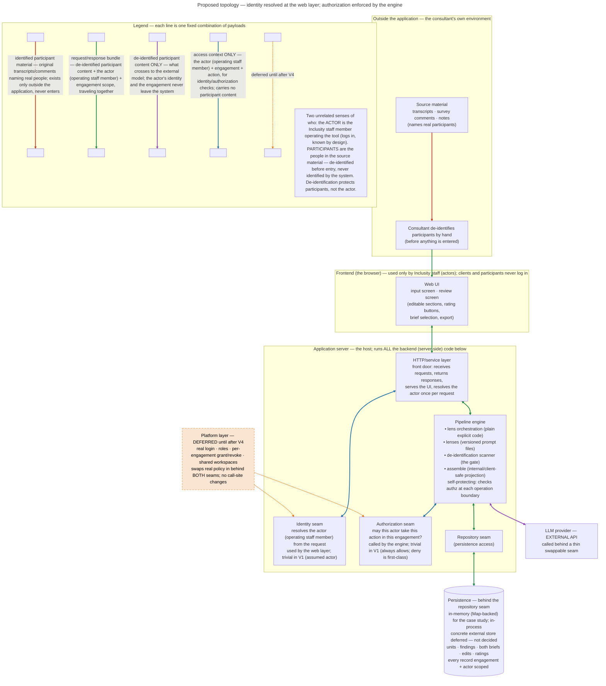

> Edited only in the chat where this file is the working copy. All other chats: read-only reference.

# Build Implementation (SMI Internal)

*Design-of-implementation for Human Lens — how the architecture in `build_approach.md` gets built: the stack, the component choices, code-level structure, lens orchestration, and the test approach. This is **not** the source code; the code will live in a repository. This document is the bridge between the architecture and that repository. Where this document and `build_approach.md` ever disagree, the architecture document wins.*

*Owned by the build chat — same lane as `build_approach.md` and `build_context.md`. Reference-only elsewhere.*

---

## Fundamental components (the stack)

An inventory of the parts the Module 1 architecture requires, grouped by layer. Each entry names what the part does and why the architecture needs it. Specific product and version choices are recorded here as they are settled; entries marked **TBD** are still under discussion. (Terminology: the whole project is the *case study*; its first built version is **V1**, "The Trustworthy Engine.")

### Two stacks at a glance (frontend / backend)

A quick view of the decided stack along a second axis — *where the code runs* — complementing the concern-based grouping (A–D) below. The two stacks have separate build pipelines: **Vite** for the browser app, **`tsc`** for the server.

**Frontend — the webapp (browser):**
- Framework: **Aurelia 2** (TypeScript)
- Styling & components: **TailwindCSS** + **Aurelia Headless UI** (DaisyUI fallback)
- HTTP client: **Axios**
- Build & test: **Vite** (7.x) + **Vitest**

**Backend — server-side (Node.js):**
- Runtime: **Node.js** + **TypeScript**
- HTTP/service layer (the front door that serves the webapp): **Fastify** + `@fastify/swagger(-ui)`, **Awilix** DI
- AI core / pipeline engine (the domain logic — see Section A): LLM provider SDK, lens orchestration, prompt / version management, **de-id detector** *(detector choice parked pending the Inclusity conversation)*
- Persistence: **repository seam**, in-memory implementation
- Supporting libraries: **export library** — `docx` (brief model → .docx); PDF out of scope for the case study
- Build & test: **`tsc` → ES modules** + **Vitest**

Both the de-id detector and the export library are backend (server-side), but they play different roles: the detector belongs to the AI-core engine (the hard gate before the lenses), while export is a supporting service invoked to produce the output document. Axios sits on the frontend; server-side outbound calls go through the provider SDK behind the provider seam. This axis answers *where code runs*; it does not flatten the backend — the engine, the service layer, and persistence remain distinct within it.

### A. The AI core — the genuinely new, highest-risk part

- **LLM provider + model.** The model behind every lens call — the engine the lenses run on. This is *whose* model: the API vendor (Anthropic, OpenAI, Google, and the like) whose service the lenses send instructions to. *Choice: **Anthropic (Claude)** is the first real implementation behind the seam (added for Listening; model id a single named constant). Constraint: kept behind a thin, swappable seam, mirroring the auth-seam philosophy, so the provider can change without touching call sites. Caveat: the integration is swappable cheaply (rewrite one adapter), but lens wording and the seeded eval set (the known-hard regression battery — sensitive, bilingual, contradictory — defined in `build_approach.md`'s evaluation section) get tuned to whichever model is actually used, so switching providers means re-validating the lenses against that set — the plumbing is loosely coupled, the behavioral calibration less so.*
- **Lens orchestration.** Runs the seven lens prompts as the staged five-wave pipeline, passing findings between stages and running independent lenses in parallel. The architecture's core control structure. *Choice: TBD.*
- **Prompt / version management.** The lenses are separate, individually versioned artifacts. Per-lens revision, the learning loop, and regression safety all depend on this. *Choice: TBD.*
- **De-identification scanner.** The gate's detector: scans candidate units for residual identifiers and drives `deid_status`. The de-id gate is a hard gate on the pipeline. *Choice: TBD. Architecture says simple first — scan + human-confirmed checkpoint.*

### B. The application shell — standard web-app machinery

- **Language / runtime.** *Decided: **TypeScript**, full-stack.* Chosen on builder fluency and operating model (the deciding factor for a two-person team), not ecosystem hype. Human Lens calls hosted models via the provider seam and does no training, retrieval-pipeline, or custom-ML work, so Python's ML-ecosystem advantage does not apply here. **Deliberately still open:** the **de-identification detector** is the one remaining choice — TBD, parked pending the Inclusity conversation. (Frontend stack and export library now decided; see below.)
- **HTTP/service layer.** The front door that exposes the already-built pipeline as a web-accessible service — receives requests, returns responses, serves the UI, resolves the actor once per request — then calls into the engine. The lens and orchestration logic is **not** here; it lives in the AI core (Section A). This is a thin wrapper around that core: the engine is plain TypeScript exercised directly from tests or a small harness with no server running, so the service layer is chosen late and swapped freely without touching lens code. V1 requires a web-based UI with no local install. *Decided:* **Node.js** runtime; **Fastify** as the API framework, with **`@fastify/swagger` + `@fastify/swagger-ui`** generating the OpenAPI documentation from the route schemas (one source of truth for both validation and docs); **Awilix** for dependency injection — explicit registration, **no decorators or `reflect-metadata`** (keeps the build off the legacy-decorator track entirely), actively maintained, with per-request scoping that suits Fastify; **Vitest** for tests (the same runner as the frontend); and **`tsc` emitting ES modules** as the build (no bundler needed server-side — `"type": "module"` + `NodeNext` resolution + `.js` import specifiers). **Axios** is available as an HTTP client, but server-side outbound calls are mostly the LLM provider, made through the provider's SDK behind the provider seam, so Axios may see little use here. The **Awilix composition root** is the natural home for wiring the seams — repository, identity/authorization, LLM provider — to their concrete implementations. *(TSyringe was considered and rejected: low-maintenance, and it pins the project to legacy `experimentalDecorators` + `emitDecoratorMetadata`.)*
- **Frontend / UI.** The input screen and the review/output screen — editable sections, rating buttons, brief selection, export. Human review is a first-class pipeline stage, not an afterthought. *Decided: **Aurelia 2** (TypeScript) as the framework; **TailwindCSS** for styling with **Aurelia Headless UI** (`@aurelia-ui-toolkits/headless` + its Tailwind companion) for accessible, composable primitives; **Axios** as the HTTP client to the backend. Fallback kept in mind: **DaisyUI** (CSS-only Tailwind plugin, framework-agnostic, mature) if Aurelia Headless UI proves too young.* Headless / light-DOM is the deliberate choice — primitives are styled by Tailwind directly, with no Shadow DOM. (Fluent UI Web Components was dropped precisely for its Shadow-DOM styling friction.) Watch items: Aurelia Headless UI is brand new (1.0.0, small community) — treat it as upside, lean on it where it earns its place rather than depending on it for the whole UI, with DaisyUI as the proven fallback; pin Vite 7.x (Vite 8 / Rolldown had an Aurelia plugin glitch in beta). The UI surface is modest (two screens), so a small set of primitives plus a few bespoke Aurelia custom elements suffices — no large component kit needed.

### C. The data layer

- **Persistence (a repository seam).** The pipeline depends on a repository *interface* — store and fetch units by engagement, persist findings and both briefs, record edits and ratings — not on any database. For this case study the implementation is **in-memory (Map-backed)**: no database, no hosting constraint, nothing to operate. The interface is shaped as if a real store backed it — **async signatures** and **engagement + actor scope carried on every operation** — so a concrete store can drop in later without touching call sites, exactly as the platform layer swaps in behind the auth seams. The in-memory store still **enforces the engagement + actor isolation invariant** (scoping is part of the trust story being demonstrated, not something the mock waves away). *Concrete database deferred — not decided. A durability spectrum sits behind the same interface if a live demo must survive a restart: pure in-memory → JSON-file snapshot → a single SQLite file, each a near-zero-ops step up.*
- **Identity & authorization seams (code).** The call-site abstractions whose signatures are settled in `build_approach.md`; policy is deferred to the platform layer. Present from V1, resolving trivially. *Signatures settled; implementation shape TBD.*

### D. The dev & ops layer

- **Build / test / source control / packages.** *Decided:* **Vite** (build tool/dev server, pin 7.x), **Vitest** (test runner, Vite-native), **GitHub** (source control), **Node.js + NPM** (runtime + package management). Plus the stub/mock discipline for the seams and the structural evaluation tier as regression guards — safe prompt revision rests on this. The Aurelia 2 + TS + Vite + Tailwind + Vitest combination is a supported stock scaffold preset.
- **Hosting / deployment.** Where the application runs. Must be low-maintenance for a roughly 17-person firm with no IT team. *Settled for now as a capability profile, not a product: a host that can run a **long-lived Node process** and serve **public web hosting** (inbound HTTPS), with **outbound HTTPS** to the model API and a place for **secrets**.* With PDF / LibreOffice out of scope, the earlier sidecar-binary and persistent-disk requirements fall away — this is now an ordinary Node-app profile that most container / small-VM / app-platform hosts satisfy. The capabilities and what each fulfills:
  - **Long-lived Node process** (not per-request serverless): runs the Fastify service layer and the pipeline engine, and **holds the in-memory repository's state across requests** — a FaaS that resets each invocation would wipe it. This is now the *only* hard constraint; it still rules out pure serverless / edge while allowing any always-on container, VM, or app service.
  - **Inbound public HTTPS (web hosting):** the web UI with no local install. One Fastify process serves both the built Aurelia assets (`@fastify/static`, same origin — no CORS) and the API on a single port. At the app layer this is just "listen on a port and serve static files"; the host adds public **ingress** and **TLS/HTTPS** (non-negotiable for confidential material) — both configuration, not code, on a typical platform.
  - **Outbound HTTPS (egress):** the engine's calls to the hosted LLM provider through the provider seam / SDK.
  - **Secure config / secrets:** the LLM provider API key and the per-client branding config via env vars / a secret store, never in code.
  - **Controlled, single-tenant environment:** confidential consulting material on a host SMI controls with access controls; favors one controlled instance over shared multitenant FaaS.
  - **Persistent disk — now optional:** needed *only* if a demo opts into the persistence durability spectrum (JSON snapshot / SQLite file) to survive a restart; pure in-memory needs no disk at all.

  *Specific product still deferred; this profile is the requirement set any product must satisfy.*
- **Document export.** Turns a finished brief (held as structured data inside the system) into a file the actor can hand off. Typically only the client-safe brief is exported for sharing; the internal candid brief stays with the team. A V1 output requirement. *Decided:* an **export seam**; its case-study implementation renders the assembled brief model → **.docx**, generated programmatically with the **`docx`** library (dolanmiu — TypeScript-first, zero runtime dependencies, runs in Node/browser/serverless, MIT). Programmatic generation fits the brief's *variable* structure (findings vary in count, sections per domain, the internal/client-safe projection) better than a fixed placeholder template. Branding is **per-client**, applied as a branding config (logo, palette, fonts, header/footer, cover) at generation time — the structure stays uniform, only the brand parameters vary; the adapter reserves that parameter from the start even if the case study ships a single default theme. **PDF is out of scope for the case study** — the seam keeps a docx→PDF stage addable later if the product ever needs it (the faithful path would be headless LibreOffice, dropped here because it pulled a heavy containerized host dependency the case study doesn't need). docx is pure Node and adds no host requirements. Low-stakes and late: export reads the already-assembled brief at the very end, behind the seam, and touches nothing else in the pipeline. (docxtemplater — branded template-fill — was considered and rejected: the variable structure and per-client branding both favor code generation over hand-maintained template files, and its advanced features are paid modules. The seam leaves that route open if Inclusity ever wants client-supplied templates.)

### Proposed topology (illustrative — product-agnostic by design)

This shows how the inventoried components fit together: what runs where, and what travels along each connection. The diagram is kept **product-agnostic by design** — the boxes name *roles* (the host, the HTTP/service layer), not products. The stack behind them is now largely settled (see above); only the hosting product and the de-id detector remain open. Persistence is deliberately *not* a database here but a **repository seam with an in-memory implementation**, with a concrete store deferred. The *architecture-level* facts the diagram depicts are already locked in `build_approach.md` and will not change with the stack: de-identification happens before entry so identified participant material never crosses into the application; the identity and authorization seams are split — identity resolved at the web layer once per request, authorization enforced by the engine at each operation boundary, so the engine is self-protecting; the platform layer swaps real policy in behind both seams without touching call sites; and there is no path from de-identified content back to a participant.

Each line is one fixed combination of payloads (colored by combination, described in the legend); the two senses of "who" — the **actor** (operating staff member) and the **participants** (the de-identified people in the material) — are called out in the note, since de-identification protects the participants, not the actor.



---

*Decisions below are filled in one at a time as they are settled, with rationale, in the same discuss-then-record discipline used for the architecture.*

### Repository layout & code structure (settled)
*Decided:* an **npm-workspaces monorepo** (one GitHub repo, `dkent600/HumanLens`) with three packages under `packages/`: **frontend** (`@humanlens/frontend`), **backend** (`@humanlens/backend`), **shared** (`@humanlens/shared`). A VS Code multi-root `.code-workspace` surfaces the three packages plus the repo root. The two build pipelines stay separate as designed — **Vite** for frontend, **`tsc`** for backend/shared.

**`shared` carries only the client-safe contract** — the DTOs that cross backend→frontend — consumed by both sides via its package exports. This makes the package boundary *enforce* the internal/client-safe invariant: because only client-safe shapes are published in `shared`, the frontend cannot import an internal type (client-safe ⊆ internal, realized in code). Internal domain types stay in `backend` (`domain/types.ts`) and must never enter `shared`. The contract currently holds the `ClientSafeFinding` DTO and the `ClientSafeBrief` wire envelope (`{ engagementId; findings: readonly ClientSafeFinding[] }`) the brief route returns, plus the intake DTOs `UnitSubmission` (the actor's own de-identified input), `IntakeAck`, and `DeidScanSummary` (aggregate counts). *The boundary's real rule is "no internal type crosses," not "only client-facing shapes":* `shared` carries both client-safe output shapes and actor-input shapes, and what unifies them is that none is an internal domain type. (So actor-facing input belongs here; an internal or per-unit `deid_status` shape does not — see the deferred trust-zone note below.)

**`backend` is one package, not split** — seam discipline is enforced by internal folders, not package boundaries:
- `engine/` — the framework-free pipeline engine (plain TS; no concrete Fastify / DB / provider; reaches the model only through the injected LLM provider seam): `IntakeService` (self-protecting — asks the authorization seam at its boundary; deny is first-class); `BriefService` (self-protecting read — authorizes the brief-view at its boundary [`type: brief.view, briefType: client-safe`], then synthesizes and projects the client-safe brief; mirrors `IntakeService`); the de-id gate; and the **staged lens system** — the `Lens` interface (each lens declares its `wave`) with `WAVE_ORDER` (evidence → meaning → aggregate → interpret → guardrail → openings), the **staged orchestrator** (runs each wave against a snapshot of prior-wave findings only, so same-wave lenses stay independent; the Guardrail wave may supersede a finding by id, every other wave appends), **Assemble** (projects the one finding set into the internal + client-safe briefs — a pure projection; voice/shaping is a separate, deferred stage, not here), and the seven Module-1 lenses under `lenses/` (plus a shared `prompt-projection` helper).
- `seams/` — identity; authorization (deny = decision object with a reason; AllowAll in V1); repository (async, engagement + actor scope on every op; in-memory Map-backed, enforces the isolation invariant); deid-detector (the parked, swappable detector behind one interface; trivial + configurable stub); **LLM provider** (domain-agnostic — `complete({system?, prompt}) → {text, stopReason?, httpStatus?}`; a deterministic fake drives the lenses in tests; the real `AnthropicLlmProvider` sits beside it, selected only on the dev path — see "Lens↔model contract" below).
- `routes/` + `server.ts` — the thin Fastify front door (`@fastify/swagger(-ui)`; resolves the actor once per request via the identity seam, threads it inward).
- `composition-root.ts` — the Awilix composition root; explicit registration, no decorators. `buildContainer()` takes an optional `llmProvider` override and is otherwise pure: with no args it uses the silent fake, so tests keep the held-by-default proofs. The dev bootstrap (`index.ts`) *alone* injects a promoting fake and seeds a fixture engagement (`fixture/`, already-cleared de-identified units) — the promoting fake never reaches `buildContainer`, and the fixture grows no intake path.
- `domain/` — the internal domain shapes: the internal types (`types.ts`) and the **`Finding`** type — a discriminated union `SurfacingFinding (verbatim, noticing null) | InterpretiveFinding (verbatim null, noticing) | AbsenceFinding (both null)`, so the verbatim⊕noticing XOR is a **compile-time** property (absence exempt) — with its factories (`makeOrdinaryFinding`, now taking a discriminated `verbatim`|`noticing` arg and raising `MissingNoticingError` on empty interpretive text; `makeAbsenceFinding`; `reviseDisposition`, which preserves an interpretive finding's `noticing` through a Guardrail revision) — strength derived from the support set, anchoring enforced, and disposition (`cleared_to_client_safe`, held by default; `sensitivity`) set only through the factory, never hand-set.

*Rationale:* promoting `engine` to its own package later is a cheap, non-breaking move if the seam discipline holds, so the split is deferred; the only cross-package boundary that earns its keep now is `shared`, because both sides genuinely consume the client-safe contract. ESLint (flat) + Stylelint are hoisted to the repo root so all packages share one config.

**De-id gate placement (code):** the gate is an **engine machine step** (`engine/deid-gate.ts`), *not* an authorization call site. `clearedUnitsForLenses` is the single sanctioned source of units for lens processing, so a non-cleared unit cannot reach the lenses; the detector sits behind the `deid-detector` seam, parked. *(As actor-facing operations are added — fetch brief, submit review, export — each gets its own authorization check at its boundary, the same pattern as `IntakeService`; internal pipeline steps do not each need one.)*

**Read path (brief route):** `GET /engagements/:engagementId/brief` → `200 { engagementId, findings: ClientSafeFinding[] }` (the client-safe brief only — the route reads `.clientSafe`, never `.internal`), `403 { error, reason }` (authorization deny — built and tested, dormant under AllowAll in V1), `404 { error }` (engagement holds no in-scope material). The authorization decision lives in the engine (`BriefService`), not the route; the route maps the service's discriminated result to HTTP and never re-checks; `synthesize` / `assembleBrief` stay machine steps. (This is the first HTTP path that runs the pipeline; the `POST` intake route and the de-id scan exist but do not synthesize.)

*Stack realized (V1 skeleton):* frontend (Aurelia 2 rc.1 + Vite + Tailwind v4), backend (Fastify 5 + Awilix), shared (client-safe contract); root ESLint (flat) + Stylelint. This section describes the **stable structure**. For **running build state** — which seams and lenses are implemented, the current test count, and per-increment progress — see `build_context.md` (the operational log).

### Lens↔model contract (real provider)
The LLM provider seam is `complete({system?, prompt}) → {text, stopReason?, httpStatus?}`, domain-agnostic. The seam **surfaces `stopReason` and HTTP status** rather than collapsing them away (`stopReason` is optional — a signal-less provider omits it and routing proceeds body-only, unable to tell chosen-empty from refusal; the abstraction doesn't pretend otherwise) — the completeness accounting (below) depends on the finish signal, and wiring it through is the committed **first implementation task**. (The prior seam returned only `{text}` and mapped a refusal to `{text:''}`; that collapse *was* the fake-empty drop the fix closes.) `AnthropicLlmProvider` (`@anthropic-ai/sdk`, model `claude-opus-4-8` as a single named constant, Messages API, adaptive thinking) sits beside `FakeLlmProvider` as a second implementation. *As of this writing it is wired for Listening and Human Meaning.*

**The prompt-and-parse contract** (split to fit the unchanged seam): a lens's *versioned `system` prompt* carries posture + task + the evidence rule + the exact JSON output shape (`{"findings":[{"verbatim","translation?","sourceLanguage?","evidenceUnitIds"}]}` — the `translation`/`sourceLanguage` pair present only when the source isn't usable English); the *`prompt`* carries the units JSON — the existing convention, unchanged, so `FakeLlmProvider` (which reads only `prompt`) is unaffected and one call drives both. The lens parses tolerantly (strip a ```json fence, `JSON.parse` in try/catch, field-validate each candidate); the unchanged **anchoring guard** then validates cited ids against the run's in-scope cleared units and trims any the model invented. Disposition stays held-by-default; support stays derived. **Interpretive lenses** (Human Meaning first) use the same split with two differences: the output shape carries `noticing` instead of `verbatim` (`{"findings":[{"noticing","evidenceUnitIds"}]}`), and the `prompt` carries the projected prior-wave findings — via the shared `prompt-projection` helper, whose English resolver is `noticing ?? translation ?? verbatim` — not units. Human Meaning reads the Listening findings, interprets **per-voice** (may emit multiple noticings per voice), and inherits each finding's single unit as its anchor; the single-unit bound is **structural**: the model names a `sourceFindingId` (the one Listening voice) and the lens inherits that voice's anchor (`source.evidenceLinks[0]`, sliced to one) in `human-meaning-lens.ts` — not the shared factory — so a meaning finding provably carries exactly one unit and an unresolvable or hallucinated source → silence. (The only shared-seam change is an optional `sourceFindingId?` on `LensResponseCandidate`.)

**Four-state accounting (the trust boundary, wired):** implements the principle in `build_approach.md` ("Lens processing"). Each voice's call resolves to exactly one terminal state, read from the body **and `stopReason`** (never body alone): **answered-with-findings** (natural finish, parseable findings); **answered-empty** (natural finish — `end_turn`, or `stop_sequence` where a lens uses one — with a usable empty body: a chosen silence, never retried); **delivered-but-unusable** (a malformed/unparseable body, *or* a non-natural finish — `max_tokens` / `refusal` / `pause_turn` / `tool_use` — the model did not usably answer but nothing broke: retryable at the model layer, reason code `refused | malformed`); **failed** (transport/API failure: **propagates**, retryable at the infra layer, the SDK handling 429/5xx/network first). The load-bearing change from the prior wiring: a **refusal is no longer collapsed to `{text:''}` silence** — that collapse was the fake-empty drop (refusal → empty → answered-empty → never-retried → a permanently, silently dropped voice). Separating answered-empty from delivered-but-unusable requires the finish signal, which is why the seam surfaces `stopReason`. Findings-level behavior is unchanged (bad output still yields no fabricated finding and never crashes); the four states are the *accounting* layer above that.

**Selection (Option A — one lens first):** `buildContainer()` is pure (fake default) and the running server stays on the fake; the real provider is selected only by a dev entry point (`selectLlmProvider()` reads `ANTHROPIC_API_KEY`) and exercised only by the **eval harness** (`npm run eval -- listening`, parameterized for the next lens). No real call in any test. A half-real pipeline was rejected — the other six lenses are non-defensive and fake-tuned, so it would prove nothing real while adding content-routing complexity. The server goes real only once *all* lenses are defensive.

**Structured outputs — deliberately declined.** Pushing a JSON schema through `complete()` would couple the seam to a provider-specific capability; the seam is deliberately prompt-in/text-out so any provider (the fake, a future local model, one without structured outputs) can sit behind it. It would also remove only the malformed-JSON failure mode — a schema constrains shape, not truth, so the anchoring guard (schema-valid JSON can still cite a hallucinated id), refusal handling, and transport-error handling are all still required; the defensive parse stays regardless. Any future adoption is a deliberate, provider-agnostic seam evolution (e.g. an optional capability negotiated behind the seam), not a schema on `complete()`.

### Completeness — orchestration (adopted)
Completeness is an accounting property in code (`build_approach.md` glossary + "Lens processing"), realized here. It was validated end-to-end by the V-1 adversarial simulation *before* adoption (below).

**Per-voice lenses — fan-out.** One model call per voice, keyed by voice id; the model never receives a list, so per-call it cannot skip an item. A **persistent ledger** (`node:sqlite`, WAL) keyed **(run_id, voice_id)** records each voice's terminal state; the ledger write precedes/is atomic with finding persistence, and **findings persist iff the terminal state is answered-with-findings** (truncated partials never become authoritative — the G-1 persistence half). First embodiment is **synchronous parallel fan-out** with a concurrency limiter (~seconds per pass — keeps the build→look→tune loop interactive). Properties, all validated by V-1: **P1** totality (every voice in exactly one of the four states) · **P2** no-silent-path (answered-empty requires a usable empty body *and* natural finish) · **P3** provenance integrity (each finding's id checked against the id sent in *that* call; hallucinated / cross-voice quarantined) · **P4** routing (malformed/refusal → unusable; transport → failed) · **P5** idempotent, voice-id-keyed writes · **P6** report accuracy · **P7** answered-empty is never retried (anti-fabrication) · **P8** recoverability (crash + restart → totality restored, completed voices not re-run) · **P9** termination (bounded attempts at both layers; the run provably ends; exhaustion → reason code `retries-exhausted`). **Adapter totality:** the seam adapter is a total function — every SDK/network outcome, including exceptions during parse / stream / teardown, maps to exactly one of the four states; no unhandled path.

**Cross-voice lenses — cited-or-residual audit.** No per-voice call; the lens reads the whole finding set. Completeness becomes an orchestrator-computed set difference over existing provenance (`sourceFindingId` / evidence links): every upstream finding is either cited by some pattern or lands in a **computed, surfaced residual**. The residual is code, never lens-emitted (a model that silently drops a finding can't be trusted to report it); a non-empty residual is expected; the audit and its coverage ratio are review diagnostics, never stated to the model as a target.

**Transport & non-adoptions.** A provider **batch API** (Anthropic Message Batches) is a later **transport swap behind the same seam** — one voice per request, request id = voice id, explicit terminal statuses, `expired` treated as retryable; it changes price and latency, not the accounting, and sync fan-out remains for interactive/eval runs. **Option 2** (k-voice batching + id-reconciliation + retry tiers + dead-letter) is **not built**, kept adoptable — voice-id keying everywhere preserves that option if scale ever forces it. Structured outputs remain declined (above).

**The V-1 validator** (`packages/backend/src/eval/completeness/`, eval-tier) proved this holds regardless of model behavior: a per-voice fan-out skeleton + a hostile model mock (behaviors a–l) property-tested with fast-check — ~7,000 seeded runs, P1–P9 + adapter totality + run-scoping + G-1 green, crash / SIGKILL-resume 3× non-flaky. Real-model falsifiers: **F1-a** totality 50/50 reps (0 unaccounted; u9 — the original silent-drop voice — answered every run); F1-b narrowed the fake-empty drop to the refusal variant; F2 cost (output-dominant), F3 latency (18.2s / 25 voices concurrent — interactive). The **fake-empty-drop seam fix** (surface `stopReason` / status; stop collapsing refusal → `{text:''}`) is the committed **first implementation task** — owed under any mechanism (under batching a single refusal would empty a whole multi-voice call, strictly worse).

### Frontend code structure (Module 1)
The frontend (`@humanlens/frontend`, Aurelia 2) mirrors the engine's seam discipline. Per screen, four layers: **View** (`.html`, presentation only; formatting via value converters) → **ViewModel** (the routed component, transient per activation, holds no durable state) → **Store** (concrete DI singleton; internal state + *structural* transforms — group findings by lens, build the `parent` subtheme tree) → **Seam** (the outward boundary to the backend — the Fastify front door, via Axios).

**Seam discipline is asymmetric, deliberately mirroring the engine.** Only the **outward seam is an interface token** (`DI.createInterface` + Axios impl + a deterministic fake), because the external boundary is the one worth substituting — so Store → ViewModel → View test with no server. **Stores are plain concrete DI singletons** (the frontend analog of the engine's internal coordinators like Assemble / the orchestrator), not interfaces. Seam only where substitution earns it.

**Expected outcomes are result values, not exceptions** — the seam returns `{ ok: true; data } | { ok: false; reason }` (mirroring the authorization decision object); exceptions are reserved for transport failures. `reason` cases map onto the engine's real semantics, never a parallel taxonomy.

**Two stores by SRP — design recorded, only `BriefStore` built in V1:** `IntakeStore` (compose + submit material — deferred to the intake slice, the path that reaches the parked de-id gate) and `BriefStore` (present + review the assembled brief; holds `ClientSafeFinding[]`, a status/reason, the `not-found | denied` reason set with `not-ready` reserved). Coupled only by an engagement/brief id through the router; the backend (in-memory repository, both briefs) is the single source of truth. Display strength is number→text in a **View value converter**; the Store owns only structural derivation (no weak/moderate/strong bucket — that would be a separate, considered decision).

**Client-safe brief only.** `shared` is the entire surface the frontend can import, `BriefStore` holds `ClientSafeFinding[]`, the seam returns `shared` DTOs — so client-safe ⊆ internal is enforced by the *package boundary*, not by convention. A facilitator-facing **internal**-brief view is deferred and needs its own contract / trust-zone decision; it **cannot** be an extension of `BriefStore`, because internal types are not in `shared` by design.

Lifetimes: Stores / seams singletons (survive navigation); ViewModels transient per route activation.

**Naming convention (folder = role, filename = resource).** A file's *folder* names its architectural role; its *filename* names the resource. So the path announces what a file is without opening it, and the frontend matches the backend's folder-by-role layout (`engine/` `seams/` `routes/` `domain/`). The rules:
- `pages/` — Aurelia routed component pairs (`brief-page.ts` + `.html`, co-located, since the framework pairs `.ts`/`.html` by basename); `stores/` — Stores; `seams/` — outward seams; `resources/` — Aurelia resources / value converters. The app shell (`my-app`) and bootstrap (`main.ts`) stay at `src/` root (singletons, not a role-group).
- The folder carries the role, so files keep descriptive names without a role suffix (`brief-store.ts`, not `brief-store-store.ts`) — exactly as the backend's `seams/` holds `repository` / `export` unsuffixed. The one suffix that *is* meaningful is the **outward seam's resource kind**: `-api` = an HTTP boundary; a future DB boundary would be `-db`, a blob store `-store`, etc.
- A **seam ships with its fake beside it** (`seams/brief-api.ts` + `seams/brief-api.fake.ts`), in `src/`, not `test/` — the fake is part of the seam's definition, mirroring the backend's `FakeLlmProvider` living beside `llm-provider`.
- **"Service" is reserved for the backend** (self-protecting domain operations: `IntakeService`, `BriefService`). The frontend's outward layer is a **seam** layer, never called "Service."

Current frontend layout:
```
src/
  main.ts · my-app.{ts,html,css} · resource.d.ts   (root: bootstrap + app shell)
  pages/      welcome-page · about-page · brief-page  (Aurelia component pairs)
  stores/     brief-store.ts
  seams/      brief-api.ts · brief-api.fake.ts        (outward seam + its fake)
  resources/  support-text.ts
```
(`welcome`/`about` are leftover scaffold pages, kept for now; retiring them is a deferred cleanup.)
